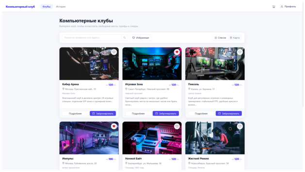
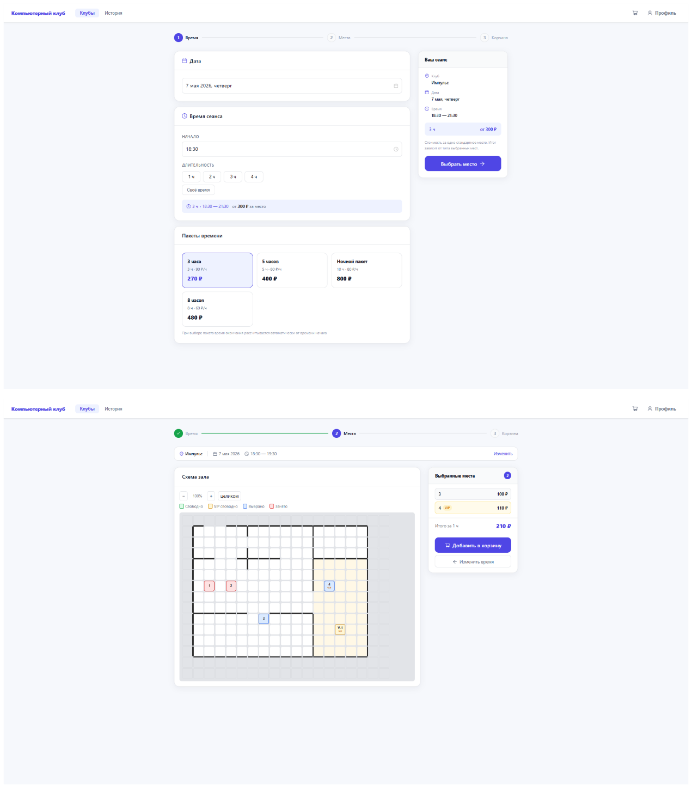
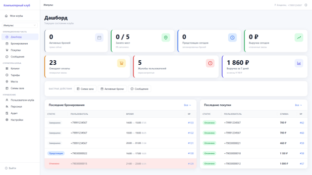
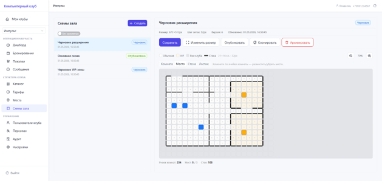
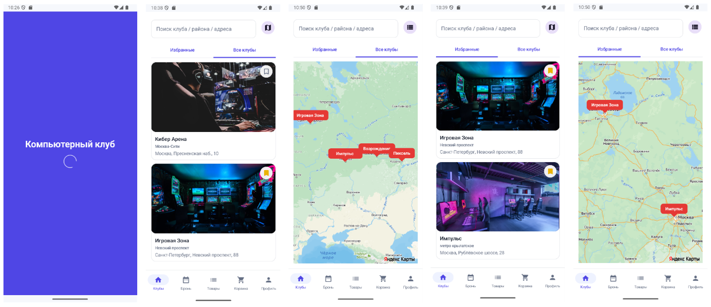
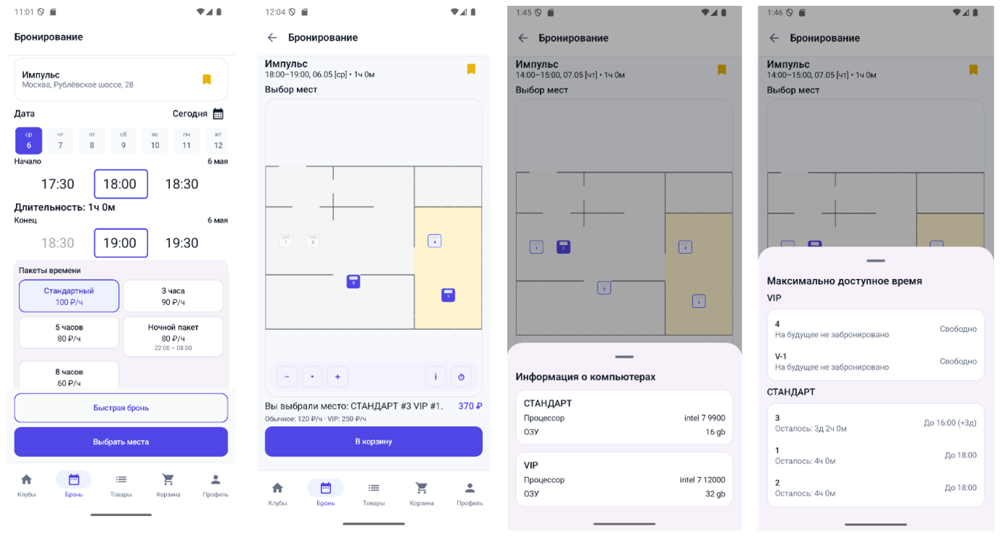
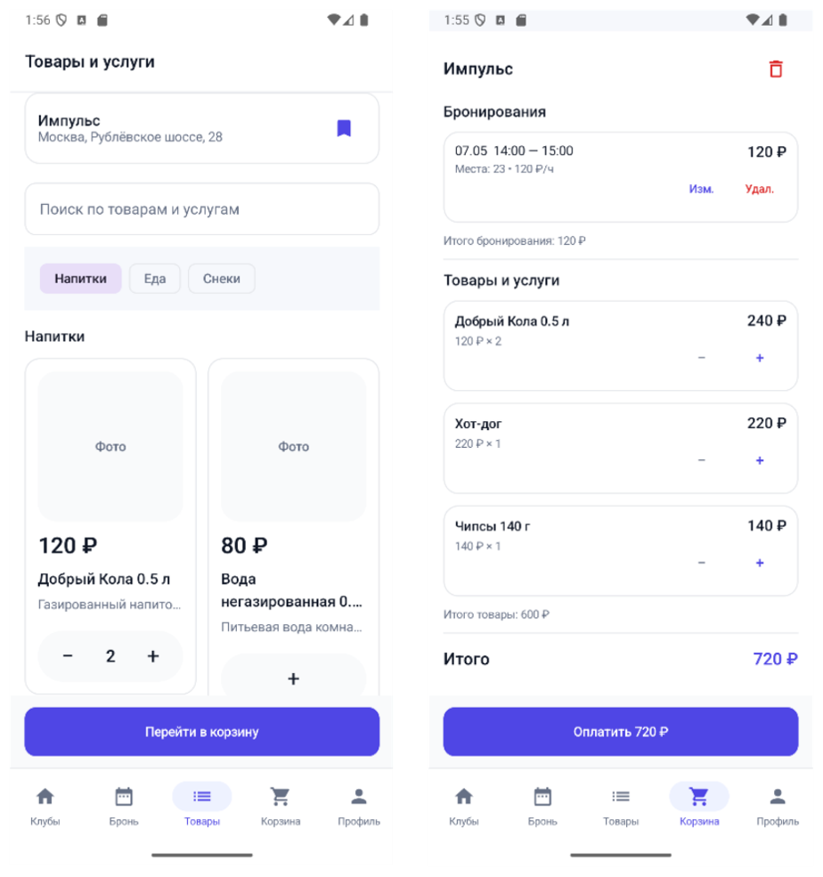

# Computer Club Management Platform

Fullstack management system for computer clubs: a Spring Boot backend, a React web interface for clients and administrators, and an Android client application.

The project covers the core workflow of a real club platform: browsing clubs, checking seat availability, booking time, adding products to cart, checkout, purchase history, owner dashboards, staff permissions, catalog management, floorplans, user moderation, reports, and platform-level administration.

## Screenshots

### Web client




### Admin panel




### Android app





## Stack

### Backend

- Kotlin, Java 21
- Spring Boot 3
- Spring Security, JWT authentication
- Spring Data JPA, Hibernate
- PostgreSQL
- Redis
- Flyway migrations
- OpenAPI / Swagger UI
- Docker Compose for local infrastructure

### Web

- React 18
- TypeScript
- Vite
- React Router
- Ant Design
- Axios

### Android

- Kotlin
- Jetpack Compose
- Material 3
- Retrofit, OkHttp
- DataStore
- Navigation Compose
- Yandex Maps SDK

## Repository Structure

```text
Computer_Club/
  computer-club-backend/   Spring Boot REST API, database migrations, auth, business logic
  computer-club-web/       React web app for clients, club owners and platform admins
  ComputerClub/            Android application built with Kotlin and Jetpack Compose
```

## Main Features

- Phone OTP authentication for clients
- Admin login and token refresh flow
- Club catalog with details, products, favorites and reports
- Seat availability checks and booking workflow
- Cart with booking lines and product lines
- Checkout, payment simulation, cancellation and purchase history
- Published floorplans with seat availability
- Club owner dashboard
- Club catalog, seats, prices and time packages management
- Floorplan editor with publish, unpublish and clone actions
- Staff and permission management
- Club user reports, warnings and blocks
- Platform admin panel for users, clubs, applications and global catalog
- Audit log for club administration actions
- OpenAPI documentation at `/swagger`

## Backend Setup

Requirements:

- JDK 21
- Docker Desktop
- PostgreSQL and Redis can be started through Docker Compose

Create a local secrets file:

```powershell
cd computer-club-backend
Copy-Item application-secrets.example.yaml application-secrets.yaml
```

Start infrastructure:

```powershell
docker compose up -d
```

Run the backend:

```powershell
$env:DB_PORT='5433'
.\gradlew.bat bootRun
```

Backend runs on:

```text
http://localhost:8080
```

Useful endpoints:

```text
GET  /api/v1/ping
GET  /swagger
GET  /api-docs
```

## Web Setup

Requirements:

- Node.js
- npm

Install dependencies and start the web app:

```powershell
cd ..
cd computer-club-web
npm install
npm run dev
```

The Vite dev server prints the local URL in the terminal, usually:

```text
http://localhost:5173
```

Build production assets:

```powershell
npm run build
```

## Android Setup

Requirements:

- Android Studio
- Android SDK
- JDK compatible with the Android Gradle plugin

Open the `ComputerClub` folder in Android Studio.

Optional local configuration can be placed in `ComputerClub/local.properties`:

```properties
MAPKIT_API_KEY=your_yandex_mapkit_key
```

Run the app on an emulator or a physical Android device. The mobile app uses the backend API for clubs, booking, cart, checkout and profile flows.

## Web Routes

Client-facing routes include:

- `/clubs`
- `/clubs/:clubId`
- `/clubs/:clubId/shop`
- `/clubs/:clubId/booking`
- `/clubs/:clubId/booking/seats`
- `/clubs/:clubId/cart`
- `/history`
- `/profile`

Admin routes include:

- `/admin/platform/applications`
- `/admin/platform/clubs`
- `/admin/platform/catalog`
- `/admin/platform/users`
- `/admin/my-clubs`
- `/admin/club/:clubId/dashboard`
- `/admin/club/:clubId/catalog`
- `/admin/club/:clubId/seats`
- `/admin/club/:clubId/floorplans`
- `/admin/club/:clubId/staff`
- `/admin/club/:clubId/bookings`
- `/admin/club/:clubId/purchases`
- `/admin/club/:clubId/users`
- `/admin/club/:clubId/audit`
- `/admin/club/:clubId/settings`

## API Areas

- `/api/v1/auth` - client OTP auth, refresh, logout
- `/api/v1/admin/auth` - admin auth
- `/api/v1/clubs` - public club catalog and club reports
- `/api/v1/cart` - booking and product cart
- `/api/v1/checkout` - checkout flow
- `/api/v1/purchases` - purchase history
- `/api/v1/admin/clubs/{clubId}` - owner and staff workflows
- `/api/v1/admin/global` - platform administration
- `/api/v1/admin/global/catalog` - global catalog management

## Portfolio Notes

This repository is structured as a portfolio-grade fullstack case study. It demonstrates:

- REST API design for a business domain
- Role-based access for clients, club owners, staff and platform admins
- Database migrations and demo data through Flyway
- Stateful booking and checkout flows
- Web and mobile clients connected to the same backend
- Admin dashboards and operational tools
